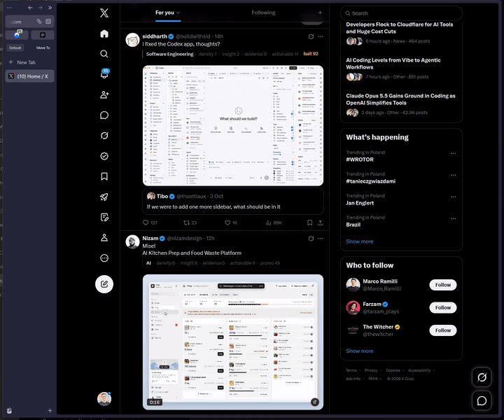
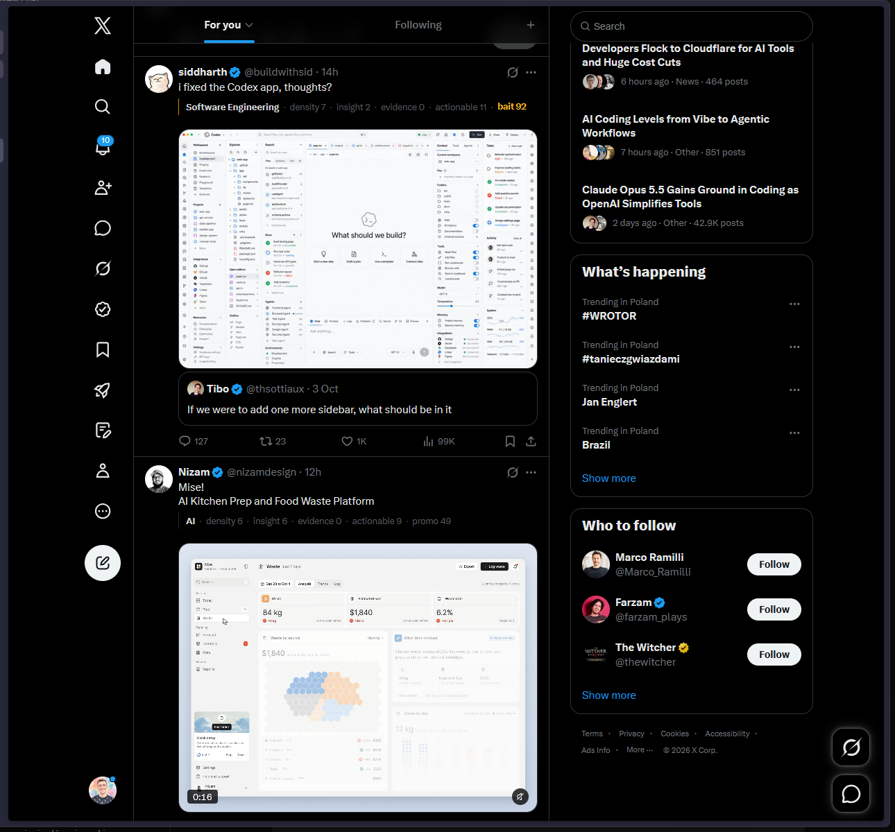
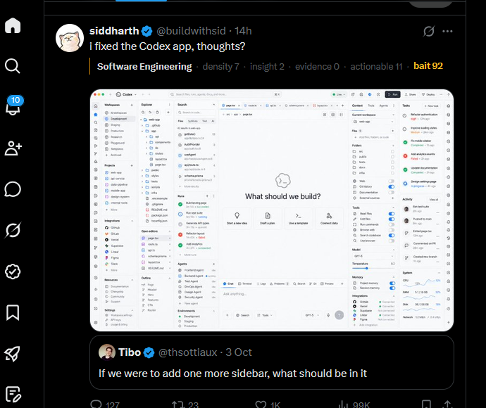
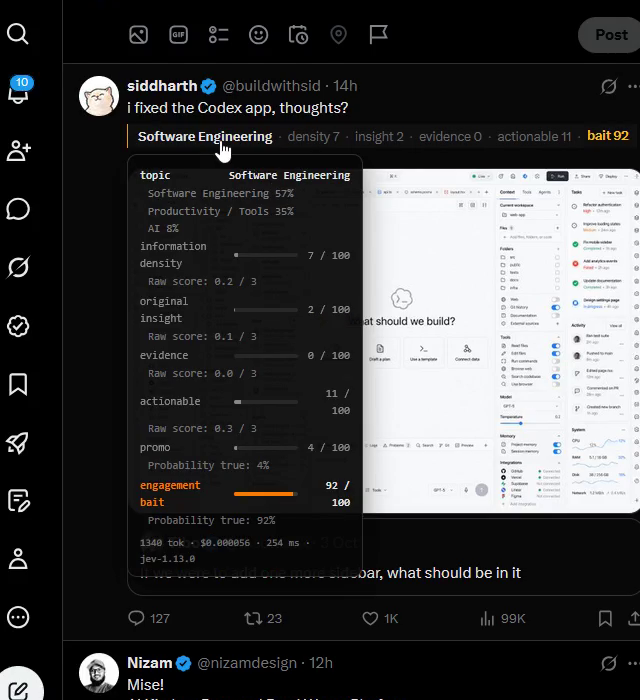
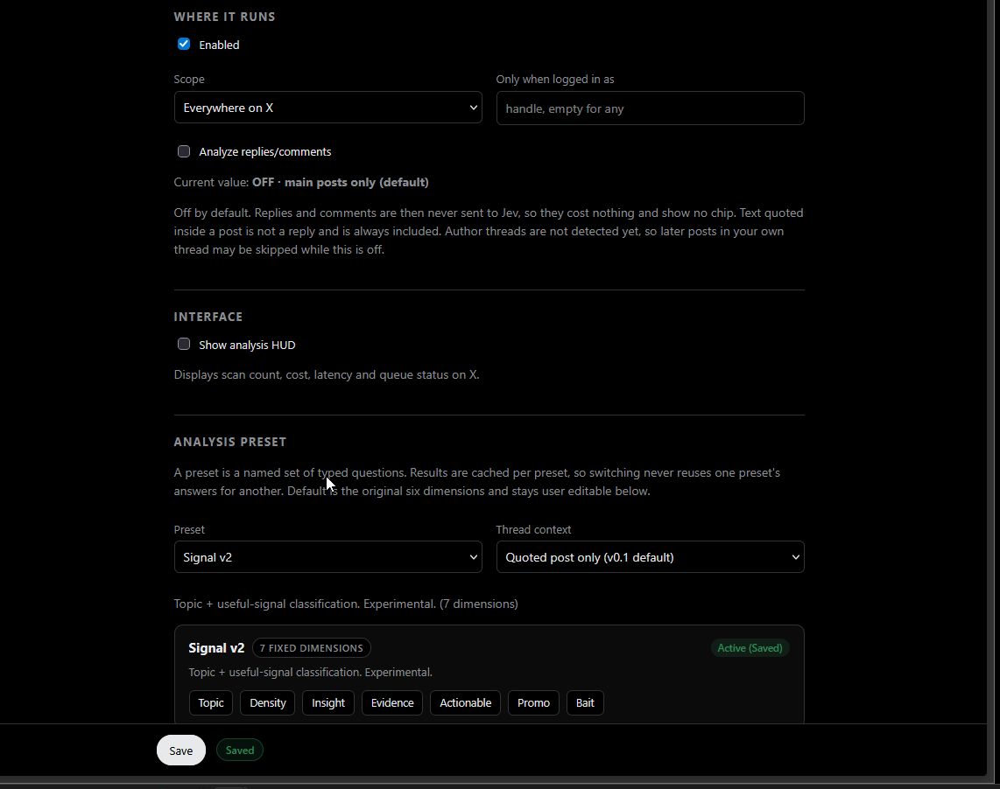

<div align="center">

# x-scanner

[](https://github.com/datawarsaw/x-scanner/releases)
[](LICENSE)
[](docs/FIREFOX_SIGNING.md)
[](#chromium)
[](https://github.com/datawarsaw/x-scanner)
[](https://github.com/datawarsaw/x-scanner/actions/workflows/ci.yml)

**A compact signal layer for X: information density, originality, evidence, actionability, promotion and engagement bait — inline in the feed, without turning the timeline into another dashboard.**



</div>

X-Scanner analyzes X posts in place using Jev, TypeSafe's System One model, and adds a quiet annotation beside each post. You bring your own TypeSafe API key. X-Scanner has no project-owned backend or analytics service, and session cost and usage remain available through the optional HUD.

Firefox / Zen and Chromium builds come from one codebase. Analysis runs against `api.typesafe.ai` with your key; results are cached per preset so scrolling back never re-bills.

## Why X-Scanner

Timelines mix original research, secondhand takes, promotions and engagement traps in one undifferentiated stream. X-Scanner keeps the feed readable by answering three questions per post, separately: what it is about, how much useful signal it carries, and whether it is selling something or fishing for engagement. Dimensions stay separate — there is deliberately no single score — and quiet posts stay quiet.

## What you see

Under Signal v2 (the current experimental preset), each analyzed post carries editorial marginalia on a thin left rail: the topic first, then information density, original insight, evidence and actionability on one shared 0–100 display range. Promo and engagement bait follow a silence rule: below 40 they are omitted from the row entirely, 40–69 renders as a neutral gray metric, and at 70 or above the rail and the elevated value turn amber. Every value, including suppressed ones, is always available in the detail card. A high-signal post gets no green success styling: it is information, not a reward.



*Real feed, Signal v2: topic-led rows, neutral metrics, and one amber escalation.*



*Promo and bait stay quiet until they matter; at 70+ the rail turns amber.*

Click any annotation for the detail card: topic distribution, one bar per component with its raw semantics (a score shows `Raw score: n / 3`, a noul shows `Probability true: n%`), plus the token count, cost and latency of that call. The card is portal-rendered into a fixed overlay so it stays above post images, videos and quote cards.



*Details on click: every component, raw semantics, cost and latency — above the media, not buried by it.*

Posts that are skipped — promoted posts and posts with no text — are marked as such and never sent for analysis.

## How it works

As a post comes near the viewport it is sent to Jev with a set of typed questions in one request. The answer comes back as numbers, not prose, and lands in the annotation beside the post. A MutationObserver picks up each article X mounts; an IntersectionObserver with an 800 px look-ahead fires as a post nears it. At most 6 requests are in flight; the rest queue, and a post that scrolls away before its turn is dropped. Results cache by post id in extension storage.

## Installation

Node 22 or newer is needed to build.

```sh
git clone https://github.com/datawarsaw/x-scanner.git
cd x-scanner
npm install
```

### Chromium

```sh
npm run build:chromium
```

Open `chrome://extensions`, turn on Developer mode, click **Load unpacked**, choose `dist-chromium/`. It needs Chrome 120 or newer. Then open the x-scanner settings, paste your TypeSafe API key, click **Test connection**, then **Save**. Never paste a real key into docs, tickets, screenshots, or chat.

### Firefox / Zen

```sh
npm run build:firefox
```

Firefox and Zen run the `dist-firefox/` build. During development it loads as a temporary add-on from `about:debugging#/runtime/this-firefox` (Load Temporary Add-on, choosing `dist-firefox/manifest.json`); that install disappears when the browser restarts. A signed unlisted build installs permanently and is covered in `docs/FIREFOX_SIGNING.md`. There is no public AMO listing yet; do not expect to find this extension in the store.

Firefox uses an MV3 event-page background script (`background.scripts`) because Firefox does not run `background.service_worker` for this extension. Application code is shared with Chromium; only the generated manifest differs. The Firefox manifest carries a stable extension id (`x-scanner@datawarsaw.com`), `strict_min_version` 128.0, and a `data_collection_permissions` declaration (see PRIVACY.md).

After reloading a temporary add-on, **reload the X page** before testing: already-injected content scripts in an open tab are not guaranteed to be replaced by the reload, so stale code can otherwise look like a failed fix. See ZEN_TEST.md for the full smoke-test checklist.

### Installation modes (Firefox / Zen)

1. **Temporary development install** — disappears after a browser restart. Good for development and smoke tests.
2. **Signed unlisted install** — a Mozilla-signed build distributed by the operator, not publicly listed. Permanent across restarts. See `docs/FIREFOX_SIGNING.md`. Not yet published.
3. **Public AMO install** — normal store installation with automatic updates. Planned for later; see `docs/AMO_PUBLIC_PATH.md`. Not yet available.

## Settings and the optional HUD

The analysis HUD is **off by default**. A **Show analysis HUD** setting turns it on or off, and toggling applies live without reloading the page. When enabled, the HUD shows posts analyzed this session, dollars spent to four decimals, the last call's latency, and judgments per second. The dollar figure is exact, not estimated: Jev returns `usage.input_tokens` with every answer.



Click `session` in the HUD for a local summary: posts analyzed, cache hits, session cost, average latency, flagged counts, which dimensions showed up, and the top-scoring posts and articles. Under Signal v2 it also shows the topic distribution and the average of each component. It costs no extra Jev calls — a local aggregate of what you already analyzed, not a recommendation engine.

## Privacy, API key, and cost

- Bring your own TypeSafe API key. Paste it in settings, test the connection, save. Typical cost is about $0.00004 per post at current pricing; a thousand posts is under four cents.
- The key lives in the browser's extension storage and nowhere else. Only the background script reads it, and it is sent only as the Authorization header to the configured TypeSafe base URL.
- Post text (plus quoted text, reply flag, and thread context where the preset asks for it) and, only when you press the button, article text go to `api.typesafe.ai`. Nothing else about the post goes: no author name, handle, post id, media, or engagement numbers — except that a native X Article's own x.com URL carries the author's handle.
- There is no project-owned backend and no analytics or telemetry. Cost and usage counters are computed locally and never leave the device.
- Full details, including retention boundaries and TypeSafe's own handling of requests, are in PRIVACY.md. Security scope is in SECURITY.md.

## Presets

| preset | what it judges |
| --- | --- |
| Default | the original six dimensions (fact-dense, engagement bait, promo, secondhand, filler, jevpilled); user editable |
| Signal (legacy) | density, actionability, originality, evidence, promo, bait |
| Signal v2 | topic, information density, original insight, evidence, actionable, promo, bait (experimental) |
| AI / Tech | technical depth, benchmark support, novelty, speculation, implementation use, hype |
| Article | density, evidence, sourcing, originality, depth, promo, speculation, action (used for article analysis) |

Default is the default. Signal v2 is experimental, is never selected for you, and leaves Default's questions and behavior untouched until you switch. Results are cached per preset, so switching never reuses one preset's answers for another and never bills the same preset twice. Non-Default presets are read-only and their thresholds are first-pass defaults, not values calibrated against a labelled set.

## Articles

- **External articles.** When a post links out, an Analyze article action appears. Nothing is fetched or billed until you press it. The page is fetched without your cookies, reduced to its readable body (scripts, navigation and chrome dropped), capped at the configured character limit (8000 by default, adjustable 1000-40000), and cached under its canonical URL so it is never re-fetched.
- **Native X Articles.** When X renders a long-form article inside a post, an Analyze X article action appears next to it. The text is read out of the page already on screen — title, lead and body paragraphs — so it needs no extra permission and no extra request. It is judged under the Article preset while the post above keeps its own result, with its own cache entry.
- Truncation is marked: when the body exceeds the cap, the card says what was sent and what was cut.

## Replies and status pages

**Analyze replies/comments** is off by default. While it is off, posts X marks as replies are never sent to Jev: no cost, no annotation. On an individual status page the route decides instead: only the post whose own status ID matches the URL (the focal post) is analyzed, and the other top-level articles there — direct comments and recommendations alike — are filtered, because X does not always render a Replying to row for them. Text quoted inside a post is not a reply and is always included.

## Development

```sh
npm run build            # Chromium development build
npm run build:chromium   # same as npm run build
npm run build:firefox    # Firefox/Zen development build
npm run package          # build and zip dist-chromium/
npm run package:firefox  # build and zip dist-firefox/
npm run watch            # rebuild dist-chromium/ on change
npm test                 # unit tests
npm run test:e2e         # real extension plus fake Jev in Chromium
npm run calibrate        # real Jev calls over samples (needs TYPESAFE_API_KEY)
npm run screenshots      # 1280x800 store screenshots from the fixture
npm run typecheck
npm run validate:artifacts  # checks both generated manifests
```

The end-to-end test starts a fake Jev server, scrolls the fixture like a reader, and checks flags, cost math, caching, scope and account filters, the settings round trip, focal-post behavior on status pages, and native article billing. It needs a Chromium or Chrome for Testing binary. Branded Google Chrome no longer accepts --load-extension.

## Architecture

```
src/background.ts    service worker / event page: key, Jev calls, totals
src/shared/          questions, presets, article text, context, client, settings
src/content/         selectors, observers, extraction, queue, caches, rendering
src/options/         settings page
test/unit|fixture|e2e  pure-module tests, X-like fixture, Playwright runs
scripts/             packaging, validation, calibration, screenshots
```

## Limits

- X's DOM may change. Selectors live in `src/content/selectors.ts`; if X changes its markup, that is the file to fix. Tests run against the fixture, not live X.
- Typed judgments are model outputs, not ground truth. Jev reads literally; a post written to argue for its own classification can move an answer, which is why thresholds default high.
- Prompts are calibrated on English. Run `npm run calibrate` on your own samples before trusting the defaults in another language; post text itself goes in as written, in whatever language.
- A temporary add-on keeps running the code it was loaded with. Rebuilding does not update the running instance, and About reports the running build's own version — always remove and re-add the temporary add-on, then reload the X page, before testing new content-script behavior.
- Native X Article detection is conservative by design: it matches semantics (route status ID, heading roles, prose blocks, X's own container names), never generated class names or screen position. Unrecognized markup leaves the action hidden rather than guessing.
- Article bodies are capped (8000 characters by default) and pages that render entirely in client-side JavaScript, or hide behind a paywall or consent wall, yield little or no text. The card says so rather than sending page chrome.
- Replies by the original author that form a thread are skipped while replies are off, because X does not mark that distinction. Author-thread detection is intentionally deferred.
- Promoted posts are recognized by the Ad label in a handful of UI languages. Add yours to `selectors.ts` if X shows something else.

## Differences from upstream

Short version: Firefox / Zen support with generated browser-specific manifests, Signal v2 with topic classification, reply filtering and route-aware focal-post behavior, external and native X Article analysis, session intelligence with topic distribution, per-preset caches, and expanded tests. Details: docs/DIFFERENCES_FROM_UPSTREAM.md.

## Origin and attribution

Originally based on oso95/x-scanner. This fork adds Firefox/Zen support, Signal v2, article analysis, session intelligence, and additional cross-browser tooling. Upstream authors do not endorse this fork. See LICENSE for the MIT license text.

## License

MIT. See LICENSE.
